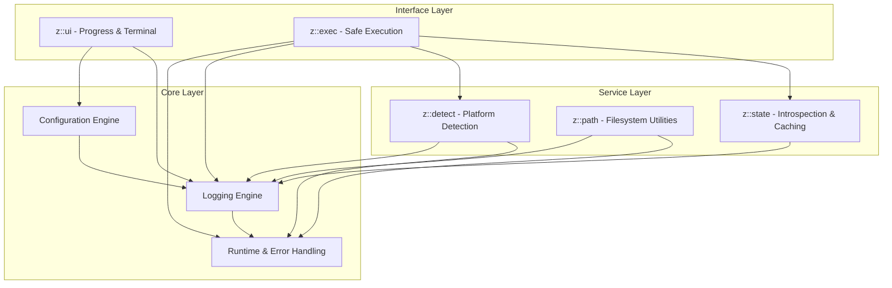
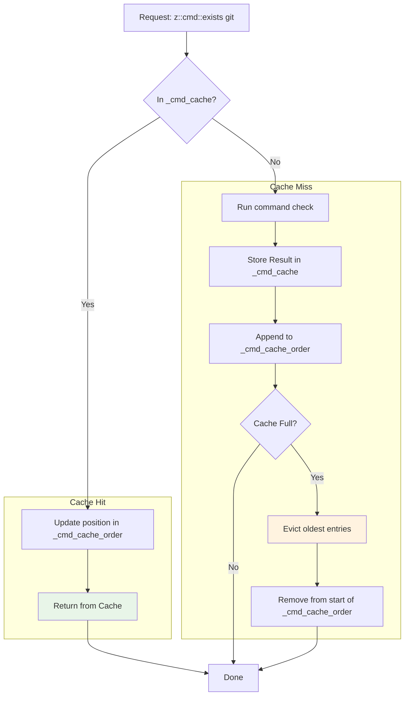

# Zcore Architecture

## 1\. Overview

**Zcore** is a comprehensive framework for Zsh designed to provide a robust and secure foundation for complex shell scripting. It offers a suite of utilities for safe command execution, performance-optimized logging, intelligent caching, cross-platform compatibility, and modern user interface elements.

This document outlines the internal architecture of the Zcore framework, detailing its components and the design principles that guide its development.
For a complete, in-depth analysis of the framework's internal design, security model, and performance characteristics, see the Full Architectural Specification.
### High-Level Architecture

The framework is built on a layered architecture, where high-level abstractions rely on foundational core components. This design promotes modularity and separation of concerns.

## 2\. Core Layer

The Core Layer provides the fundamental capabilities upon which the entire framework is built.

### Configuration Engine

Configuration is managed through a global associative array, `_zcore_config`, which serves as a single source of truth.

* **Centralized Control:** All framework behavior (log levels, timeouts, cache sizes) is controlled from one place.
* **Runtime Modifiability:** Settings can be safely changed during script execution via `z::config::set`.
* **Environment Overrides:** Key settings like `ZCORE_CONFIG_PERFORMANCE_MODE` can be initialized from environment variables for external control.

### Logging Engine

The logging engine is designed for performance and safety, featuring a centralized engine (`z::log::_engine`) that provides:

* **Leveled Logging:** Four distinct levels: `error`, `warn`, `info`, and `debug`.
* **Performance:** A cached timestamp (`z::log::_update_ts`) minimizes calls to external `date` commands.
* **Safety:** Built-in recursion protection (`_log_depth`) prevents infinite logging loops.
* **Clarity:** Color-coded output to `stderr` for immediate visual identification of message severity.

### Runtime & Error Handling

This component ensures script stability and predictable behavior.

* **Interrupt Handling (`z::runtime::handle_interrupt`)**: A global `trap` catches `INT` and `TERM` signals, setting a flag that allows long-running operations to terminate gracefully instead of crashing.
* **Fatal Error Handling (`z::runtime::die`)**: A centralized function for terminating the script. It intelligently decides whether to `exit` the process or `return` with an error code, depending on whether the script is being executed directly or sourced.

## 3\. Safe Execution Layer

The `z::exec` module is a cornerstone of the framework, designed to execute shell commands with a strong focus on security.

### Security Scanner

Before execution, commands are passed through a multi-stage security scanner (`z::exec::_scan_patterns`). This is not a foolproof sandbox but a powerful heuristic guard against common destructive commands.

```mermaid
flowchart LR
    A[Input Command] --> B{Is it a known init hook?}
    B -->|Yes| C[Bypass Scan]
    B -->|No| D{Metacharacters Check}
    D -->|"Yes: ;, &, (), etc."| E[Block Execution]
    D -->|No| F[Tokenize & Scan]
    F --> G{Dangerous Pattern Found?}
    subgraph Detected_Patterns
        direction TB
        P1[Pipe to Shell: curl ... &#124; sh]
        P2[Destructive FS: rm -rf /]
        P3[Device Writes: dd of=/dev/sda]
  P4["Fork Bomb: :(){ :&#124;:& };:"]
    end
    G -->|Yes| E
    G -->|No| H[Allow Execution]
    C --> H

    style E fill:#ffebee,stroke:#c62828,stroke-width:1px
    style H fill:#e8f5e9,stroke:#2e7d32,stroke-width:1px

```

### Execution Flow

Once a command is cleared by the scanner, it is executed with additional safeguards.

* **Subprocess Isolation:** Commands are run in a dedicated subshell (`zsh -c "..."`) to prevent them from altering the main script's environment unexpectedly. The `pipefail` option is enabled to ensure failures in any part of a pipeline are caught.
* **Timeout Protection:** A configurable timeout (via `_zcore_timeout_cmd`) prevents commands from hanging indefinitely. The framework automatically detects `timeout` (GNU) or `gtimeout` (macOS).
* **Context-Aware Evaluation:** `z::exec::eval` provides a mechanism to run code in the *current* shell when necessary (e.g., `eval "$(starship init zsh)"`), which is handled by the high-level `z::exec::from_hook` function.

## 4\. Performance & Caching Layer

To minimize latency, especially during shell startup, Zcore implements several caching mechanisms.

### Command & Function Cache

The framework maintains caches to track the existence of external commands (`z::cmd::exists`) and internal functions (`z::func::exists`), avoiding repeated expensive lookups.

**Cache Eviction Strategy: LRU (Least Recently Used)**

The cache implements a true LRU (Least Recently Used) eviction strategy. When the cache exceeds its maximum size (_zcore_config[cache_max_size]), the least recently used entries are discarded. This ensures that frequently accessed items remain cached for optimal performance.

This strategy provides a good balance of performance and implementation simplicity.

## 5\. Filesystem & Platform Layers

These layers abstract away the complexities of interacting with the underlying operating system.

### Path Resolution (`z::path::resolve`)

Provides a single, robust function for resolving any path to its canonical, absolute form.

**Resolution Strategy:**

1. **Tilde Expansion**: First, it expands `~`, `~+`, and `~-`.
2. **Zsh Native (`:A`)**: It attempts to use Zsh's highly efficient `:A` path modifier for instant resolution.
3. **Manual Fallback**: If the native method fails (e.g., path doesn't exist yet), it falls back to a manual process of resolving symlinks with a loop guard to prevent infinite recursion.

### Platform Detection (`z::detect::platform`)

This idempotent function detects the host operating system and environment, setting a series of global boolean flags (`$IS_MACOS`, `$IS_LINUX`, `$IS_WSL`, etc.). It uses `$OSTYPE` with a `uname` fallback, ensuring wide compatibility.

## 6\. UI Layer (`z::ui`)

The UI layer provides tools for creating a clean and informative user experience in the terminal.

### Throttled & Responsive Progress Bar

The progress bar (`z::ui::progress::show`) is designed to be highly performant by intelligently deciding when to redraw.

**Display Logic (`z::ui::progress::_should_show`)**:

1. **Always show** the very first and very last update.
2. For small totals, update more frequently.
3. For large totals, **update only on a set interval** (e.g., every 20 items), preventing the terminal from being flooded with updates, which would slow down the actual operation.
4. **Responsive Layout**: The bar automatically switches between a detailed and compact format based on the detected terminal width.
5. **Context-Aware**: The bar only displays in an interactive terminal (`-t 2`), when the log level is `info`, and when `_zcore_config[show_progress]` is `true`.

## 7\. Design Principles

1. **Safety First**: The default behavior is always the safest. The execution scanner, isolated processes, and graceful interrupt handling are designed to prevent catastrophic failures.
2. **Performance by Design**: Caching, avoiding subshells, and using Zsh-native features are prioritized to ensure the framework adds minimal overhead, especially in performance-sensitive contexts like shell startup.
3. **Clarity and Simplicity**: The API is designed to be self-explanatory, with clear function names and predictable behavior.
4. **Robustness over Fragility**: The framework anticipates failure. Functions validate their inputs, handle edge cases, and provide clear error messages when things go wrong.
5. **Portability**: While leveraging Zsh-specific features for performance, it maintains fallbacks and a platform detection layer to operate consistently across macOS, Linux, BSD, and WSL.
