# Core.zsh Architecture Documentation

## Overview

The `core.zsh` library is a production-ready, enterprise-grade utility framework for Zsh environments. It provides a comprehensive foundation for safe command execution, robust logging, intelligent caching, and sophisticated user interface management in complex shell environments.

## System Architecture

### High-Level Component Overview

The system is organized into seven primary layers, each with distinct responsibilities:

```mermaid
graph TB
    subgraph "User Interface Layer"
        UI[Progress System]
        TERM[Terminal Detection]
        RESP[Responsive Layout]
    end

    subgraph "Execution Layer"
        SAFE[Safe Execution]
        SEC[Security Scanner]
        TIMEOUT[Timeout Management]
    end

    subgraph "Core Framework"
        CONFIG[Configuration System]
        LOG[Logging Engine]
        INT[Interrupt Handling]
        ERR[Error Management]
    end

    subgraph "Caching Layer"
        FUNC_CACHE[Function Cache]
        CMD_CACHE[Command Cache]
        LRU[LRU Eviction]
    end

    subgraph "Filesystem Layer"
        PATH_RES[Path Resolution]
        SAFE_SOURCE[Safe Sourcing]
        SYM_RES[Symlink Resolution]
    end

    subgraph "State Management"
        UNSET[Safe Unset]
        STATE[State Tracking]
        CACHE_COHERENCE[Cache Coherence]
    end

    subgraph "Platform Detection"
        PLATFORM[OS Detection]
        WSL[WSL Detection]
        TERMUX[Termux Detection]
    end

    CONFIG --> LOG
    CONFIG --> UI
    CONFIG --> SAFE
    LOG --> ERR
    INT --> ERR
    SAFE --> SEC
    SAFE --> TIMEOUT
    FUNC_CACHE --> LRU
    CMD_CACHE --> LRU
    SAFE_SOURCE --> PATH_RES
    PATH_RES --> SYM_RES
    UNSET --> CACHE_COHERENCE
    STATE --> CACHE_COHERENCE
    PLATFORM --> WSL
    PLATFORM --> TERMUX
```

## 1. Core Framework Layer

### Configuration System

The configuration system uses a global associative array `_zcore_config` that centralizes all library settings:

```zsh
typeset -gA _zcore_config
_zcore_config[log_error]=0
_zcore_config[log_warn]=1
_zcore_config[log_info]=2
_zcore_config[log_debug]=3
_zcore_config[exit_general_error]=1
_zcore_config[exit_interrupted]=130
_zcore_config[progress_update_interval]=10
_zcore_config[timeout_default]=30
_zcore_config[log_max_depth]=50
_zcore_config[cache_max_size]=100
_zcore_config[performance_mode]=false
_zcore_config[show_progress]=true
```

**Key Features:**

- **Centralized configuration**: Single source of truth for all settings
- **Runtime modification**: Settings can be changed during execution
- **Type safety**: Integer configurations validated at usage
- **Environment overrides**: External environment variables can override defaults

### Logging Engine Architecture

The logging system implements a multi-layered approach with recursion protection and performance optimization:

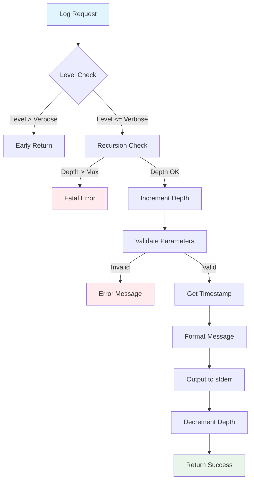

**Key Components:**

- `z::log::_engine()`: Core logging function with recursion protection
- `z::log::_update_ts()`: Performance-optimized timestamp caching
- Interface functions: `z::log::error()`, `z::log::warn()`, `z::log::info()`, `z::log::debug()`

**Security Features:**

- **Recursion protection**: Prevents infinite loops with configurable depth limits
- **Input validation**: Strict parameter validation prevents injection attacks
- **Safe output**: Uses `print -r` to prevent escape sequence interpretation

## 2. Security & Execution Layer

### Security Scanner Architecture

The security scanner implements a context-aware threat detection system:

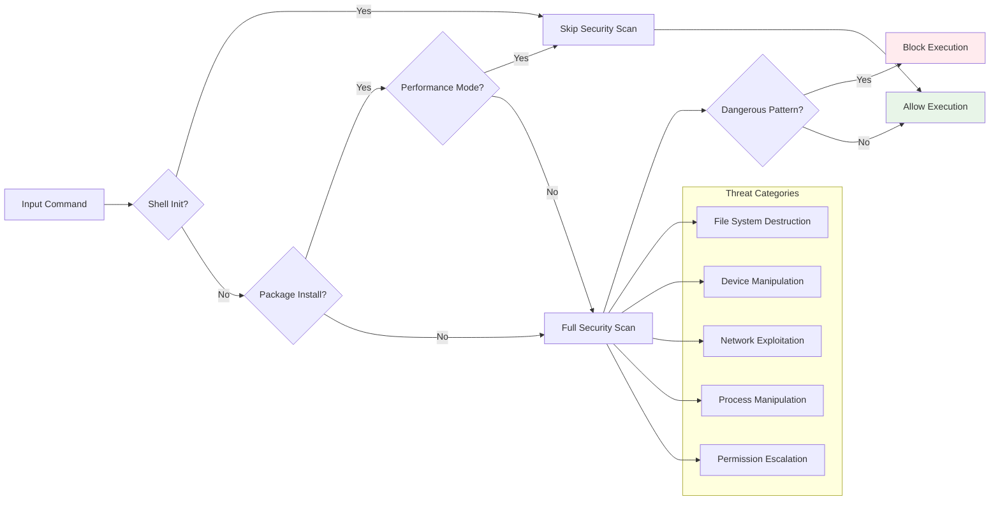

**Threat Detection Categories:**

1. **File System Destruction**: `rm -rf`, `sudo rm`, directory targeting
2. **Device Manipulation**: Direct device access, filesystem creation, `dd` operations
3. **Network Exploitation**: Pipe-to-shell patterns (`curl|sh`, `wget|sh`)
4. **Process Manipulation**: Signal operations, fork bombs
5. **Permission Escalation**: Dangerous chmod operations

**Context-Aware Security:**

- **Whitelist approach**: Trusted tools (starship, mise, direnv) bypass scanning
- **Package manager awareness**: Installation commands receive reduced scrutiny
- **Performance mode**: Can disable expensive security checks for high-throughput scenarios

### Safe Execution Architecture

The execution system provides multiple layers of protection:

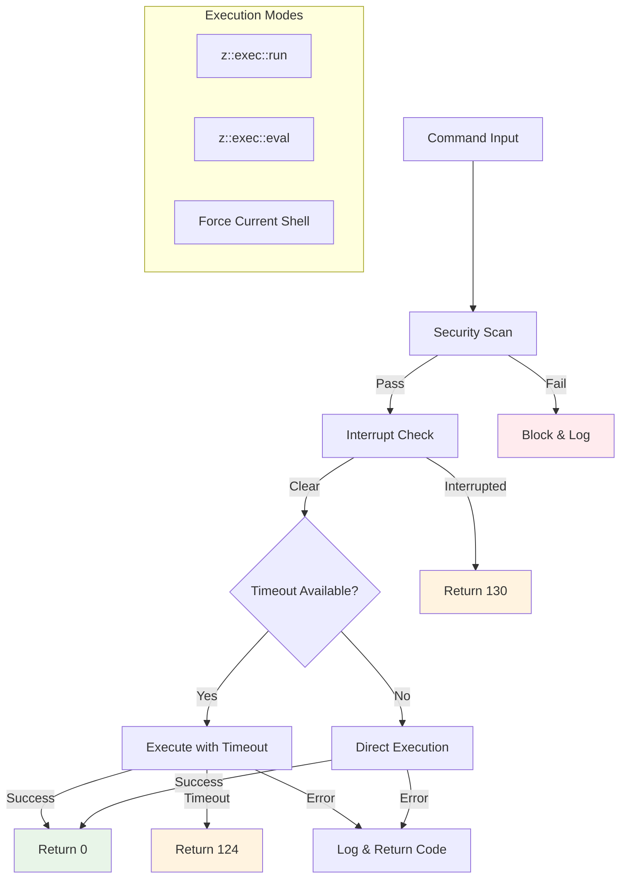

**Execution Modes:**

- `z::exec::run()`: Subprocess isolation with timeout protection
- `z::exec::eval()`: Context-aware evaluation with security scanning
- Force current shell mode: For trusted internal operations only

**Protection Mechanisms:**

- **Subprocess isolation**: Commands run in separate Zsh instances
- **Timeout protection**: Configurable command timeouts (default: 30s)
- **Cross-platform timeout**: Auto-detects GNU `timeout` or macOS `gtimeout`
- **Exit code preservation**: Maintains original command exit codes

## 3. Caching Layer

### Dual Cache Architecture

The library implements separate caching systems for functions and commands:

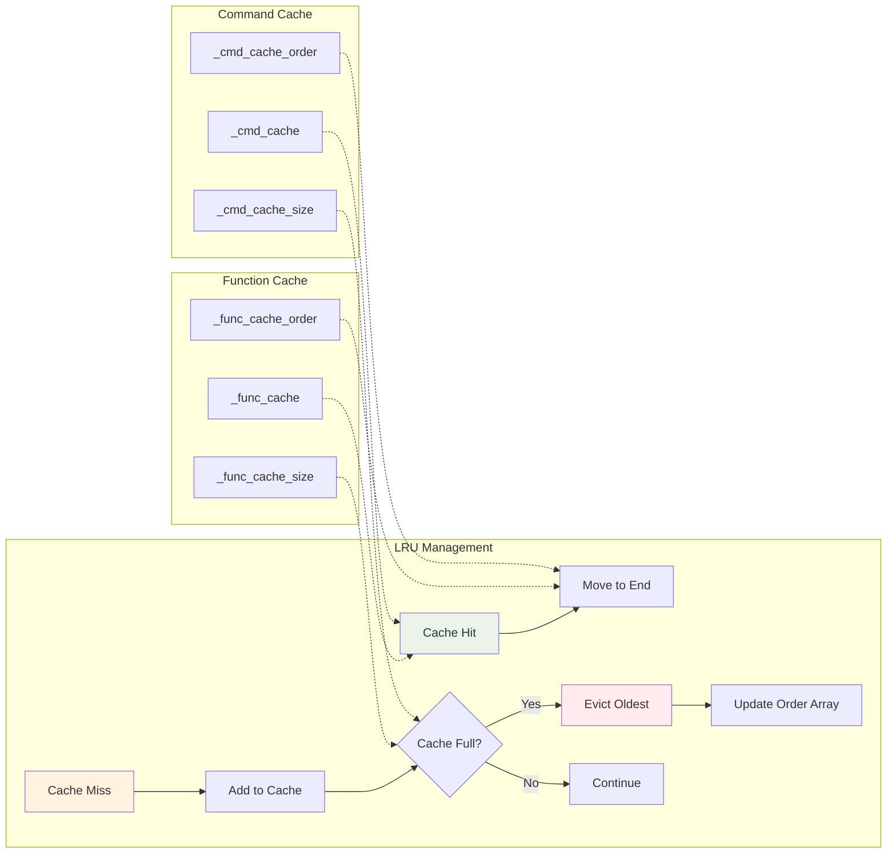

**Function Cache System:**

- `_func_cache`: Associative array storing function existence results
- `_func_cache_order`: Array maintaining access order for LRU eviction
- `_func_cache_size`: Current cache size counter

**Command Cache System:**

- `_cmd_cache`: Associative array storing command existence results
- `_cmd_cache_order`: Array maintaining access order for LRU eviction
- `_cmd_cache_size`: Current cache size counter

**LRU Eviction Strategy:**

- **Batch eviction**: Removes 50% of cache when limit exceeded
- **Order preservation**: Maintains chronological access order
- **Atomic operations**: Ensures cache consistency during cleanup
- **Performance optimization**: Reduces expensive `command -v` and `typeset -f` calls

## 4. Filesystem Layer

### Path Resolution Architecture

The path resolution system implements a multi-strategy approach with comprehensive fallbacks:

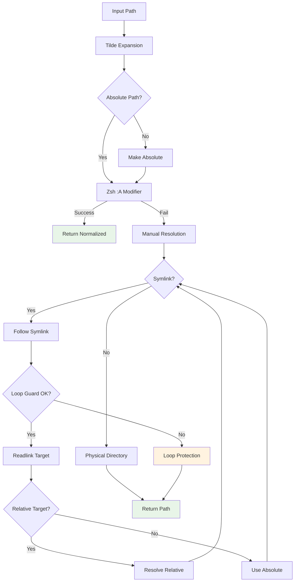

**Resolution Strategies:**

1. **Zsh-native optimization**: Uses `:A` modifier for fast resolution
2. **Manual symlink following**: Handles complex symlink chains
3. **Physical path resolution**: Uses `cd -P` and `pwd -P` for real paths

**Advanced Features:**

- **Tilde expansion**: Supports `~`, `~+`, `~-` patterns
- **Symlink loop protection**: Prevents infinite loops with configurable guard limits
- **Cross-platform compatibility**: Works with various readlink implementations
- **Performance mode**: Can skip expensive resolution for speed

### Safe Sourcing System

**Validation Pipeline:**

1. **Path resolution**: Optional path normalization based on performance mode
2. **File existence**: Verifies file exists and is readable
3. **Interrupt checking**: Ensures user hasn't cancelled operation
4. **Parameter forwarding**: Passes additional arguments to sourced file

**Error Handling:**

- Clear error messages distinguish between "not found" and "not readable"
- Exit code preservation maintains source operation results
- Logging provides diagnostic information for troubleshooting

## 5. State Management Layer

### Advanced Unset System

The state management system provides sophisticated cleanup capabilities:

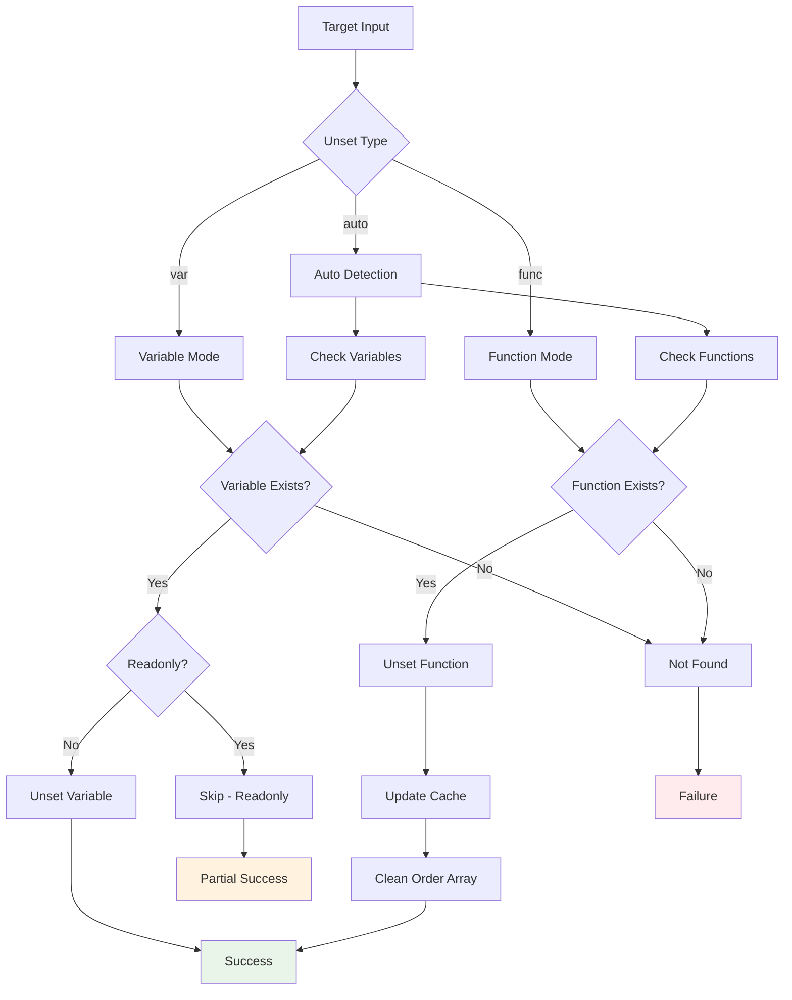

**Unset Modes:**

- `var`: Variables only
- `func`: Functions only
- `auto`: Automatic detection of both

**Advanced Features:**

- **Readonly protection**: Detects and respects readonly variables
- **Cache coherence**: Maintains function cache consistency during unset operations
- **Atomic operations**: Ensures consistent state even on partial failures
- **Type-aware**: Distinguishes between variables and functions

**Cache Integration:**

- Automatically removes function entries from existence cache
- Updates cache order arrays to maintain LRU consistency
- Recalculates cache sizes after cleanup operations

## 6. Platform Detection Layer

### Cross-Platform Detection System

The platform detection system provides comprehensive OS identification with a single function:

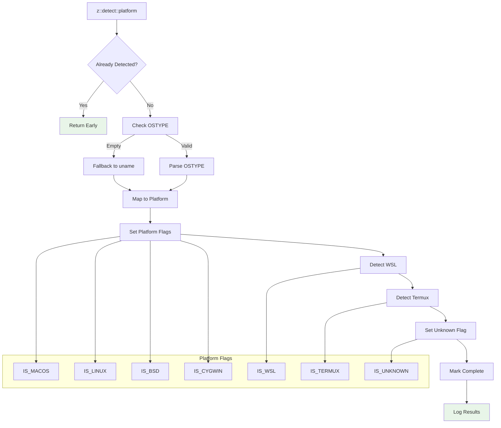

**Platform Detection Features:**

- **Idempotent design**: Safe to call multiple times with `_PLATFORM_DETECTED` guard
- **Defensive fallbacks**: Uses `uname -s` if `$OSTYPE` is empty
- **WSL detection**: Multiple detection methods for Windows Subsystem for Linux
- **Termux support**: Android terminal environment detection
- **Graceful logging**: Conditional logging based on zcore library availability

**Detected Platforms:**

- `IS_MACOS`: macOS/Darwin systems
- `IS_LINUX`: Linux systems
- `IS_BSD`: FreeBSD, OpenBSD, NetBSD, DragonFly
- `IS_CYGWIN`: Cygwin/MSYS/MinGW environments
- `IS_WSL`: Windows Subsystem for Linux
- `IS_TERMUX`: Termux on Android
- `IS_UNKNOWN`: Unrecognized platforms

## 7. User Interface Layer

### Adaptive Progress System

The UI system implements intelligent progress display with multiple optimization strategies:

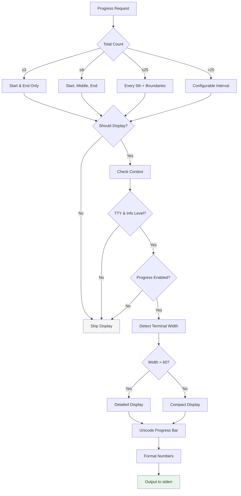

**Scale-Aware Display Logic:**

- **Micro operations (≤3 items)**: Show only start and completion
- **Small operations (≤8 items)**: Add midpoint progress
- **Medium operations (≤25 items)**: Display every 5th item plus boundaries
- **Large operations (>25 items)**: Use configurable intervals with reduced verbosity

**Context-Sensitive Display:**

- **TTY detection**: Only displays in interactive terminals
- **Verbosity awareness**: Respects current logging level
- **User preferences**: Honors progress display configuration
- **Performance mode**: Can disable progress for maximum speed

**Responsive Design:**

- **Terminal width detection**: Adapts layout to terminal capabilities
- **Unicode progress bars**: Modern visual indicators with filled/empty blocks
- **Locale-aware formatting**: Numbers formatted with appropriate thousands separators
- **Graceful degradation**: Falls back to simple display if features unavailable

## Architectural Patterns

### Error Handling Strategy

The library implements a comprehensive error handling strategy with multiple recovery mechanisms:

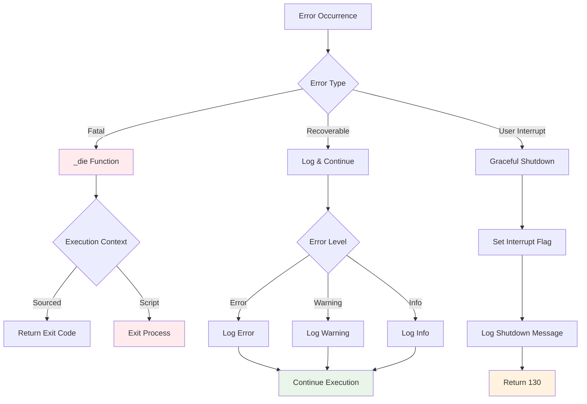

**Error Categories:**

1. **Fatal errors**: Use `_die()` function with context-aware exit/return
2. **Recoverable errors**: Log and continue execution
3. **User interrupts**: Graceful shutdown with cleanup

**Context-Aware Fatal Handling:**

- **Sourced context**: Returns exit code to avoid terminating parent shell
- **Script context**: Exits process with appropriate code
- **Configurable codes**: Uses standardized exit codes (1 for general, 130 for interrupt)

### Performance Optimization Patterns

**Caching Strategies:**

- **Dual cache system**: Separate caches for functions and commands
- **LRU eviction**: Intelligent cache management with configurable limits
- **Timestamp caching**: Avoids repeated date formatting operations
- **Terminal width caching**: Reduces expensive `tput` calls

**Performance Mode:**

- **Configurable optimization**: `ZCORE_CONFIG_PERFORMANCE_MODE=true`
- **Reduced security scanning**: Skips expensive pattern matching
- **Simplified path resolution**: Bypasses complex symlink following
- **Minimal progress display**: Reduces UI overhead

**Early Return Patterns:**

- **Log level filtering**: Early return for filtered log messages
- **Cache hit optimization**: Immediate return on cache hits
- **Context-aware skipping**: Bypass operations in known-safe contexts

### Security Architecture

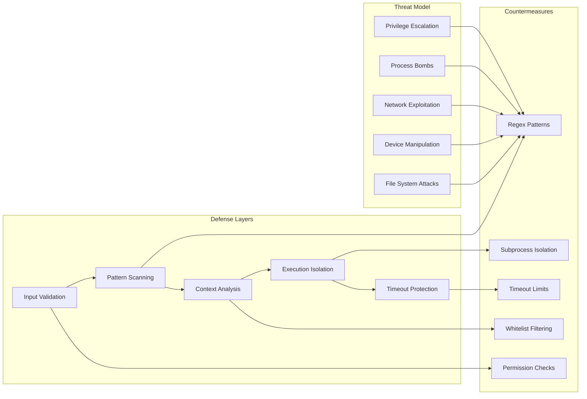

**Defense in Depth:**

1. **Input validation**: Parameter sanitization and type checking
2. **Pattern scanning**: Regex-based threat detection
3. **Context analysis**: Whitelist-based trust evaluation
4. **Execution isolation**: Subprocess containment
5. **Timeout protection**: Resource exhaustion prevention

**Threat Model Coverage:**

- **File system attacks**: `rm -rf`, directory targeting, device access
- **Network exploitation**: Pipe-to-shell patterns, remote code execution
- **Process manipulation**: Fork bombs, signal abuse, privilege escalation
- **Resource exhaustion**: Infinite loops, memory bombs, disk filling

## API Reference

### Core Functions

#### Configuration & Debugging

```zsh
z::log::enable_debug()         # Enable debug logging
z::log::get_level()            # Check current verbosity
z::log::toggle_progress()      # Toggle progress bars
z::ui::progress::clear()       # Clear progress output
```

#### Logging Interface

```zsh
z::log::error "message"        # Error level logging
z::log::warn "message"         # Warning level logging
z::log::info "message"         # Info level logging
z::log::debug "message"        # Debug level logging
```

#### Safe Execution

```zsh
z::exec::run "command" [timeout]               # Safe command execution
z::exec::eval "command" [timeout] [force_shell] # Safe evaluation with context awareness
z::func::call "function" [args...]             # Safe function calling
```

#### Filesystem Operations

```zsh
z::path::resolve "path"        # Advanced path resolution
z::path::source "file" [args...] # Safe file sourcing
z::path::add "dir" [position]   # PATH management
```

#### State Management

```zsh
z::state::unset "target" [type] # Safe variable/function cleanup
z::cmd::exists "command"       # Cached command existence check
z::func::exists "function"     # Cached function existence check
```

#### User Interface

```zsh
z::ui::progress::show current total [label]  # Adaptive progress display
z::ui::term::width()                        # Terminal capability detection
```

#### Error Handling

```zsh
z::runtime::die "message" [exit_code] # Fatal error handling
z::runtime::check_interrupted()       # Interrupt status checking
```

#### Platform Detection

```zsh
z::detect::platform()                 # Detect OS and set platform flags
```

#### Alias Management

```zsh
z::alias::define "name" "value"       # Create safe aliases
z::alias::_extract_name "alias"       # Extract command name from alias
```

#### Utility Functions

```zsh
z::util::comma "number"               # Format numbers with commas
z::ui::progress::_should_show()       # Check if progress should display
```

## Configuration Reference

### Environment Variables

```bash
# Verbosity control (0=error, 1=warn, 2=info, 3=debug)
export zcore_config_verbose=2

# Performance optimization
export ZCORE_CONFIG_PERFORMANCE_MODE=true

# UI control
export ZCORE_CONFIG_SHOW_PROGRESS=false
```

### Runtime Configuration

```zsh
# Modify log levels
_zcore_config[log_debug]=3

# Adjust cache limits
_zcore_config[cache_max_size]=200

# Set timeout defaults
_zcore_config[timeout_default]=60

# Control progress intervals
_zcore_config[progress_update_interval]=5

# Enable/disable features
_zcore_config[performance_mode]=true
_zcore_config[show_progress]=false
```

## Design Principles

### 1. Fail-Safe Defaults

- Conservative security settings by default
- Graceful degradation when features unavailable
- Non-destructive operations unless explicitly requested

### 2. Performance Awareness

- Multiple optimization levels (normal, performance mode)
- Intelligent caching with bounded memory usage
- Early returns and lazy evaluation patterns

### 3. Cross-Platform Compatibility

- Feature detection rather than platform-specific code
- Graceful fallbacks for missing utilities
- POSIX compliance where possible, Zsh optimization where beneficial

### 4. Defensive Programming

- Comprehensive input validation
- Recursion protection and loop guards
- Resource limits and timeout protection

### 5. Operational Excellence

- Structured logging with configurable verbosity
- Comprehensive error handling and recovery
- Performance monitoring and optimization hooks

## Extension Points

### Custom Security Patterns

Add new threat detection patterns by extending the security scanner:

```zsh
# Add custom security pattern in z::exec::_check_segment()
if [[ $cmd == custom_dangerous_command ]]; then
    # Add custom validation logic
fi
```

### Cache Integration

Extend caching for custom operations:

```zsh
# Custom cache with LRU eviction
typeset -gA _custom_cache
typeset -ga _custom_cache_order
typeset -gi _custom_cache_size=0
```

### Progress Integration

Add progress tracking to long-running operations:

```zsh
for ((i=1; i<=total; i++)); do
    z::ui::progress::show $i $total "processing items"
    # ... operation ...
done
```

This architecture documentation provides a comprehensive overview of the sophisticated engineering that makes this Zsh utility library enterprise-ready and production-safe.
